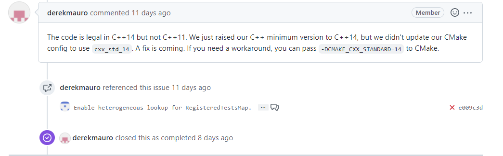
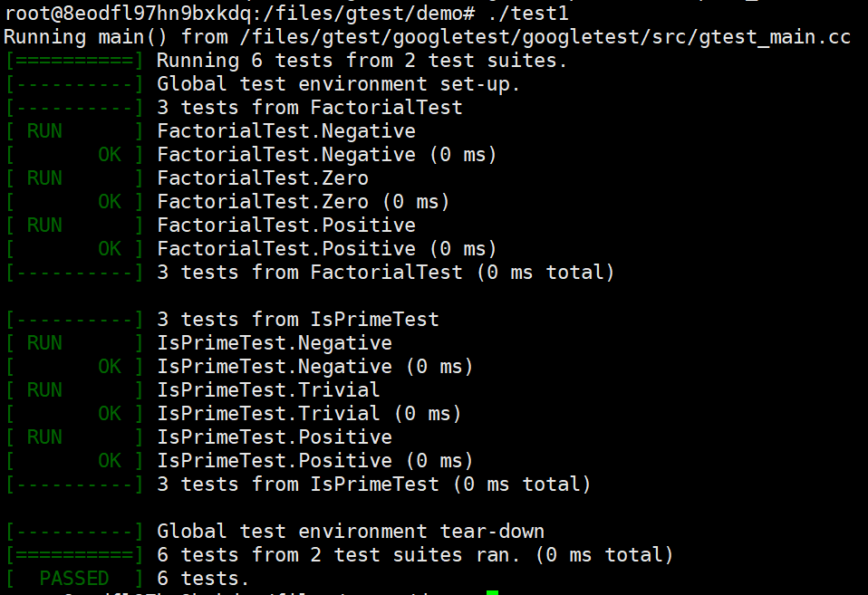
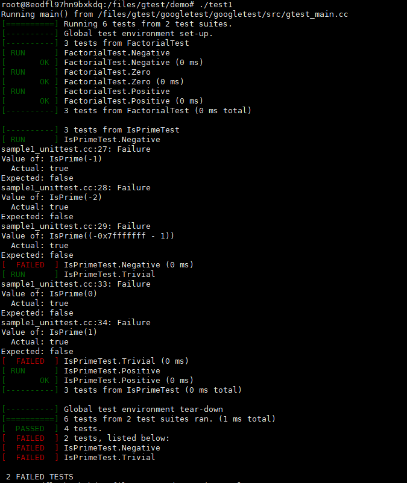

# GoogleTest】GoogleTest单元测试(1)

## 快速上手

```
GoogleTest是Google的一套用于编写 C++测试的框架，可以运行在多个平台上(包括Linux、MacOS X、Windows、Cygwin等)。基于xUnit架构，支持很多好用的特性，包括自动识别测试、丰富的断言、断言自定义、死亡测试、非终止的失败、生成XML报告等等。
以下简称GTest。
```
## GTest的优点

好的测试应包括如下特点。

```
测试应该是独立的、可重复的。一个测试的结果不应该作为另一个测试的前提。
GTest中每个测试运行在独立的对象中。如果某个测试失败了，可以单独地调试它。
测试应该是有清晰的结构的。
GTest的测试有很好的组织结构，易于维护。
测试应该是可移植和可复用的。有很多代码是不依赖平台的，因此它们的测试也需要不依赖于平台。
GTest可以在多种操作系统、多种编译器下工作，有很好的可移植性。
测试失败时，应该给出尽可能详尽的信息。
GTest在遇到失败时并不停止接下来的测试，而且还可以选择使用非终止的失败来继续执行当前的测试。这样一次可以测试尽可能多的问题。
测试框架应该避免让开发者维护测试框架相关的东西。
GTest可以自动识别定义的全部测试，你不需要一一列举它们。
测试应该够快。
GTest在满足测试独立的前提下，允许你复用共享数据，它们只需创建一次。
GTest采用的是xUnit架构，你会发现和JUnit、PyUnit很类似，所以上手非常快。
```

## 搭建测试框架

- GTest的项目地址：https://github.com/google/googletest

### 安装流程如下：

```
git clone https://github.com/google/googletest.git

cd googletest

mkdir build

cd build

cmake …

make

sudo make install
```

- 注意:

如果make过程中报错，可能是gcc版本过低，从官方项目中的issus中我们可以的值，gcc 4.8版本已经不再支持,如下图所示。

[linux make[1]: *** [googletest/CMakeFiles/gtest.dir/all]Error 2 #3639](https://github.com/google/googletest/issues/3639)


安装gcc-5(或更高版本),Ubuntu20.04安装gcc-5。
成功编译构建。
其中,/build/lib目录中会生成:libgmock.a libgmock_main.a libgtest.a libgtest_main.a文件。


## 测试示例

sample1.h

```h
#ifndef GTEST_SAMPLES_SAMPLE1_H_
#define GTEST_SAMPLES_SAMPLE1_H_

// 阶乘
// Returns n! (the factorial of n).  For negative n, n! is defined to be 1.
// 返回n！（n的阶乘）。对于负n，n！定义为1。
int Factorial(int n);

// 判断是否为质数
// Returns true iff n is a prime number.
bool IsPrime(int n);

#endif 
```

sample1.cc

```cpp
#include "sample1.h"

// Returns n! (the factorial of n).  For negative n, n! is defined to be 1.
int Factorial(int n) {
  int result = 1;
  for (int i = 1; i <= n; i++) {
    result *= i;
  }

  return result;
}

// Returns true iff n is a prime number.
bool IsPrime(int n) {
  // Trivial case 1: small numbers
  if (n <= 1) return false;

  // Trivial case 2: even numbers
  if (n % 2 == 0) return n == 2;

  // Now, we have that n is odd and n >= 3.

  // Try to divide n by every odd number i, starting from 3
  for (int i = 3; ; i += 2) {
    // We only have to try i up to the square root of n
    if (i > n/i) break;

    // Now, we have i <= n/i < n.
    // If n is divisible by i, n is not prime.
    if (n % i == 0) return false;
  }

  // n has no integer factor in the range (1, n), and thus is prime.
  return true;
}
```

sample1_unittest.cc

```cpp
#include <limits.h>
#include "sample1.h"
#include <gtest/gtest.h>
namespace {

    //TEST(测试套，测试用例名称)
    TEST(FactorialTest, Negative) {
        //调用对应函数，结果是否为1，判断测试用例是否通过
        EXPECT_EQ(1, Factorial(-5));
        EXPECT_EQ(1, Factorial(-1));
        EXPECT_GT(Factorial(-10), 0);
    }

    TEST(FactorialTest, Zero) {
        EXPECT_EQ(1, Factorial(0));
    }

    TEST(FactorialTest, Positive) {
        EXPECT_EQ(1, Factorial(1));
        EXPECT_EQ(2, Factorial(2));
        EXPECT_EQ(6, Factorial(3));
        EXPECT_EQ(40320, Factorial(8));
    }

    // Tests IsPrime()
    TEST(IsPrimeTest, Negative) {
      EXPECT_FALSE(IsPrime(-1));
      EXPECT_FALSE(IsPrime(-2));
      EXPECT_FALSE(IsPrime(INT_MIN));
    }

    TEST(IsPrimeTest, Trivial) {
      EXPECT_FALSE(IsPrime(0));
      EXPECT_FALSE(IsPrime(1));
      EXPECT_TRUE(IsPrime(2));
      EXPECT_TRUE(IsPrime(3));
    }

    TEST(IsPrimeTest, Positive) {
      EXPECT_FALSE(IsPrime(4));
      EXPECT_TRUE(IsPrime(5));
      EXPECT_FALSE(IsPrime(6));
      EXPECT_TRUE(IsPrime(23));
    }
}  // namespace
```

- 编译

```shell
g++ sample1.cc sample1_unittest.cc -lgtest -std=c++14 -lgtest_main -lpthread -o test1
```

- 注意:

本文发布时，GTest已不支持C++11,所支持最低版本为C++14, 所以-std=c++11会报错，错误解决(原issues)

[Commit e009c3d fails to build with "error: wrong number of template arguments (0, should be 1)#3934"](https://github.com/google/googletest/issues/3934),

将c++版本指定为c++14。（开始我还以为是我ubuntu的版本太低了，特意换了台机子。）



上面的sample1_unittest.cc测试程序中，我们并没有写main函数，因为我们链接了gtest_main这个库。

测试时，选择有代表性的用例进行测试。

执行

```shell
./test1
```



测试用例全部通过

接着，我们修改一处代码(本次修改判断质数函数中的一处代码，将原来返回false的位置改为ture。),重新编译执行，发现错误。



手写main函数

```cpp
int main(int argc, char** argv)
{
    testing::InitGoogleTest(&argc, argv);
    return RUN_ALL_TESTS();
}
```

编译:这是编译时就可去掉gtest_main库。

```shell
g++ sample1.cc sample1_unittest.cc -lgtest -std=c++14  -lpthread -o test1
```

- 参考原文链接：[【GoogleTest】GoogleTest单元测试(1)快速上手](https://blog.csdn.net/qq_51604330/article/details/125878897?ops_request_misc=%257B%2522request%255Fid%2522%253A%2522169820707416800180614808%2522%252C%2522scm%2522%253A%252220140713.130102334..%2522%257D&request_id=169820707416800180614808&biz_id=0&utm_medium=distribute.pc_search_result.none-task-blog-2~all~sobaiduend~default-1-125878897-null-null.142^v96^control&utm_term=googletest%E5%8D%95%E5%85%83%E6%B5%8B%E8%AF%95&spm=1018.2226.3001.4187)